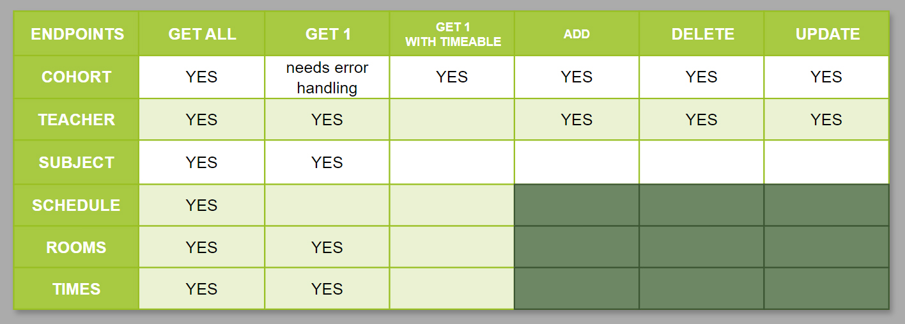

# README:

## What is the problem the app solves and why does it need solving?

The problem this app solves is that of coordinating student time tables, teacher timetables, and room bookings for classes. It is in fact solving three problems in one:

1. Scheduling of class times for students
2. Booking of rooms for classes
3. Assigning teachers to classes.

It manages all 3 of these tasks and also coordinates between them making sure there are no clashes of bookings, multiple teachers assigned to classes, etc.

This problem needs to be solved so that this information is not held within different, unconnected tables. Currently at the school where I teach, student timetables are stored in a word document, teacher timetables are stored in a separate word document, and room booking is controlled by a completely different system altogether that doesn't even store the information of what the room is booked for, just that it is booked.

This API pulls all this information together into one streamlined database management application.

## Why have I chosen this database and how does it compare to others?

For this app I have chosen to use PostgreSQL as the relational database management system. There are several reasons for this. For one, it is a very popoular, open-source system. As such it has extensive documentation, tutorials, and support.

PostgreSQL offers advanced features such a suuport for complex SQL queries, indexing, full-text search, JSON data types, geospatial data, and user-defined functions. It is known for its reliability, stability, and ACID compliance (Atomicity, Consistency, Isolation, Durability), which ensures data integrity and consistency. It also offers very robust options for scalability which make it ideal for growing apps and high-traffic websites.

Compared to other systems there are some drawbacks.

PostgreSQL can by more resource intesive compared to some alternatives. It's advanced features can make the system quite complex, which leads to a greater learning curve for beginners. PostgreSQL's main focus is on relational databases, and while it does support JSON data types and some NoSQL features, it may not be as robust or specialized for NoSQL workloads compared to dedicated NoSQL databases like MongoDB or Couchbase.

## Identify and discuss the key functionalities and benefits of an ORM

Object-Relational Mapping (ORM) tools are designed to bridge the gap between  object-oriented programming (OOP) used in applications, and the relational database model used for data storage. Some key functionalities and benefits of using an ORM are:

- Mapping Objects to Database Tables:

  - ORM tools map objects in your application code to tables in the database, allowing you to work with database entities as native objects in your programming language (e.g., Python, Java, C#).
  - This mapping simplifies data manipulation by abstracting away the complexities of SQL queries and database schema details, making database interactions more intuitive and developer-friendly.

- CRUD Operations (Create, Read, Update, Delete):

  - ORM tools provide methods and APIs for performing CRUD operations on database entities using object-oriented syntax.
  - Developers can create, retrieve, update, and delete records in the database using familiar object-oriented patterns and conventions, reducing the need to write low-level SQL queries manually.

- Relationship Management:

  - ORM tools handle relationships between database tables (e.g., one-to-one, one-to-many, many-to-many) by defining associations between corresponding object classes in the application.
  - This simplifies querying and navigating related data, as ORM tools automatically handle join operations and data retrieval across related entities.

- Querying and Filtering:

  - ORM tools offer query language or methods that allow developers to perform complex database queries, filtering, sorting, and aggregation operations using high-level abstractions.
  - Developers can write queries using object attributes and properties, which are translated by the ORM tool into optimized SQL queries for efficient data retrieval.

- Transaction Management:

  - ORM tools provide transaction management capabilities, allowing developers to work with atomic database operations within transaction boundaries.
  - Transactions ensure data consistency and integrity by allowing multiple database operations to succeed or fail together as a single unit, preventing data inconsistencies in case of errors.

- Database Agnostic Code:

  - ORM tools abstract the underlying database details, making the application code database agnostic.
  - Developers can write application logic without worrying about specific SQL dialects, database vendor differences, or schema changes, as the ORM tool handles database-specific operations and optimizations transparently.

- Code Reusability and Maintainability:

  - ORM promotes code reusability and maintainability by encapsulating database access logic within object models and data access layers.
  - Changes to the database schema or query optimizations can be made centrally in the ORM configuration or model definitions, reducing the impact on the rest of the application codebase.

## Document all endpoints for your API

### Authorisation

- Login: '/auth/login' GET
  - This route registers a user into the session.
  - It requires the users email and password in the body of the request.
  - It returns the users email, a bearer token, and admin status.

- Test: '/auth/test' GET
  - This route is just a test route I made to check that the admin authentication function was working as intended.
  - It requires a bearer token and returns a success message if the user is an admin.

### Cohorts

- Get all cohorts: '/cohorts' GET
  - This route uses the GET method to return all the entries in the Cohorts model.
  - It returns each cohort, their ID, and year group.
  - Any user can access this endpoint.

- Get one cohort: '/cohorts/<cohort_id>' GET
  - This route uses the GET method to return a single entry from the Cohorts model.
  - It requires the ID number of the Cohort as part of a dynamic route.
  - It returns the cohort and each subject that cohort is enrolled into.
  - Any user can access this endpoint.

- Add a new cohort: '/cohorts' POST
  - This route uses the POST method to create a new entry into the Cohorts model.
  - It requires the 'year_group' information to be included in the body of the request.
  - It returns the result of the new entry including the ID and year_group information.
  - Only ADMIN users can access this endpoint and requires a valid JWT token.

- Delete a cohort: '/cohorts/<cohort_id>' DELETE
  - This route uses the DELETE method to delete an entry from the Cohorts model.
  - It requires the ID number of the Cohort as part of a dynamic route.
  - It returns a success message stating that the appropriate entry has been deleted.
  - Only ADMIN users can access this endpoint and requires a valid JWT token.

- Update a cohort: '/cohorts/<cohort_id>' PUT, PATCH
  - This route uses the PUT or PATCH method to update an entry in the Cohorts model.
  - It requires the ID number of the Cohort as part of a dynamic route, and the year_group information to be updated from the body of the request.
    - It returns the result of the updated entry including the ID and year_group information.
    - Only ADMIN users can access this endpoint and requires a valid JWT token.

### Teachers

- Get all teachers: '/teachers' GET
  - This route uses the GET method to return all the entries in the teachers model.
  - It returns each tacher, their ID, and name.
  - Any user can access this endpoint.

- Get one tacher: '/teachers/<tacher_id>' GET
  - This route uses the GET method to return a single entry from the teachers model.
  - It requires the ID number of the tacher as part of a dynamic route.
  - It returns the tacher, each subject that tacher is assigned to teach, and the room and time information for each booking of that subject.
  - Any user can access this endpoint.

- Add a new tacher: '/teachers' POST
  - This route uses the POST method to create a new entry into the teachers model.
  - It requires the 'teacher_name' information to be included in the body of the request.
  - It returns a success message, and the result of the new entry including the ID and teachers name.
  - Only ADMIN users can access this endpoint and requires a valid JWT token.

- Delete a tacher: '/teachers/<tacher_id>' DELETE
  - This route uses the DELETE method to delete an entry from the teachers model.
  - It requires the ID number of the tacher as part of a dynamic route.
  - It returns a success message stating that the appropriate entry has been deleted.
  - Only ADMIN users can access this endpoint and requires a valid JWT token.

- Update a tacher: '/teachers/<tacher_id>' PUT, PATCH
  - This route uses the PUT or PATCH method to update an entry in the teachers model.
  - It requires the ID number of the tacher as part of a dynamic route, and the teacher_name information to be updated from the body of the request.
  - It returns a success message, and the result of the updated entry including the ID and teachers name.
  - Only ADMIN users can access this endpoint and requires a valid JWT token.

### Subjects

- Get all subjects: '/subjects' GET
  - This route uses the GET method to return all the entries in the subjects model.
  - It returns each subject, the ID, subject year, and subject name.
  - Any user can access this endpoint.

- Get one subject: '/subjects/<subject_id>' GET
  - This route uses the GET method to return a single entry from the subjects model.
  - It requires the ID number of the subject as part of a dynamic route.
  - It returns the all the subject information, the teacher assigned to that subject, and the cohort enrolled into that subject.
  - Any user can access this endpoint.

- Add a new subject: '/subjects' POST
  - This route uses the POST method to create a new entry into the subjects model.
  - It requires the 'subject_year' and 'subject_name' information to be included in the body of the request.
  - It returns a success message, and the result of the new entry including the ID, subject year, and subject name.
  - Only ADMIN users can access this endpoint and requires a valid JWT token.

- Delete a subject: '/subjects/<subject_id>' DELETE
  - This route uses the DELETE method to delete an entry from the subjects model.
  - It requires the ID number of the subject as part of a dynamic route.
  - It returns a success message stating that the appropriate entry has been deleted.
  - Only ADMIN users can access this endpoint and requires a valid JWT token.

- Update a subject: '/subjects/<subject_id>' PUT, PATCH
  - This route uses the PUT or PATCH method to update an entry in the subjects model.
  - It requires the ID number of the subject as part of a dynamic route, and the relevant information to be updated from the body of the request.
  - It returns a success message, and the result of the updated entry including the ID, subject year, and subject name.
  - Only ADMIN users can access this endpoint and requires a valid JWT token.

### Times

- Get all time_slots: '/time_slots' GET
  - This route uses the GET method to return all the entries in the time_slots model.
  - It returns each time_slot, the ID, day, and time.
  - Any user can access this endpoint.

- Get one time slot: '/time_slots/<time_slot_id>' GET
  - This route uses the GET method to return a single entry from the time_slots model.
  - It requires the ID number of the time slot as part of a dynamic route.
  - It returns  all the information for a single time slot (id, day, and time).
  - Any user can access this endpoint.

- Time slots are pre-determined and cannot be added to, deleted, or updated by regular or admin users.

### Rooms

- Get all rooms: '/rooms' GET
  - This route uses the GET method to return all the entries in the rooms model.
  - It returns each room, the ID, building, and room number.
  - Any user can access this endpoint.

- Get one time slot: '/rooms/<room_id>' GET
  - This route uses the GET method to return a single entry from the rooms model.
  - It requires the ID number of the time slot as part of a dynamic route.
  - It returns all the information for a single room (id, building, and room number), and every subject that is booked into that room for the week, including subject name and time.
  - Any user can access this endpoint.

- Rooms are pre-determined and cannot be added to, deleted, or updated by regular or admin users.

### Bookings

- Get all bookings: '/bookings' GET
  - This route uses the GET method to return all the entries in the bookings model.
  - It returns all bookings sorted by booking id. It includes the booking id, and the subject_id, room_id, and time_slot_id associated with that booking.
  - Any user can access this endpoint.

- Get one booking: '/bookings/<booking_id>' GET
  - This route uses the GET method to return a single entry from the bookings model.
  - It requires the ID number of the booking as part of a dynamic route.
  - It returns the the booking ID, and the room, subject, and time slot associated with that booking.
  - Any user can access this endpoint.

- Add a new booking: '/bookings' POST
  - This route uses the POST method to create a new entry into the bookings model.
  - It requires the subject_id, room_id, and time_slot_id entry to be included in the body of the request.
  - It returns the booking details the new entry, as well as the room details, subject details, and time_slot details associeated with that booking.
  - Only ADMIN users can access this endpoint and requires a valid JWT token.

- Delete a booking: '/bookings/<booking_id>' DELETE
  - This route uses the DELETE method to delete an entry from the bookings model.
  - It requires the ID number of the booking as part of a dynamic route.
  - It returns a success message stating that the appropriate entry has been deleted.
  - Only ADMIN users can access this endpoint and requires a valid JWT token.

- Update a booking: '/bookings/<booking_id>' PUT, PATCH
  - This route uses the PUT or PATCH method to update an entry in the bookings model.
  - It requires the ID number of the booking as part of a dynamic route, and the relevant information to be updated (subject_id, room_id, and/or time_slot_id) from the body of the request.
  - It returns the result of the updated entry including the IDs for the booking, subject, room, and time_slot.
  - Only ADMIN users can access this endpoint and requires a valid JWT token.

## An ERD for your API


## Detail any third party services that your app will use

The app will use the following third party services:

- Flask:
  - Flask is a Python based web framework that provides tools and libraries to help build we applications. It offers features such as routing, templating, request handling, and sessions management.
- PostgreSQL:
  - PostgreSQL is a relational database management system (RDBMS). It uses and extends the SQL language allowing for greater ease when working with large, complicated data sets.
- SQL Alchemy:
  - SQL Alchemy is a python toolkit and Object-Relational Mapping (ORM) library that simplifies database interactions in Python applications. It allows devs to use Python objects in place of SQL queries to simplify interaction with the database.
- Bcrypt:
  - Bcrypt is used to add a layer of security to the app. It does this by hashing user passwords to protect against unauthorized access. This protects against brute-force and rainbow table attacks.
- JWT-Extended:
  - JWT-Extended is a flask extension that provides support for JSON Web Tokens. It simplifies the creation, validation, and refreshing of JWTs. It's also used to manage user sessions and access control.
- Marshmallo:
  - Marshmallo is a library used for object serialization and validation. Flask-Marshmallow integrates the marshmallow library for use with Flask. It provides tools for defining schemasto serialize and deserialize data from the database model or API request payloads.
- Psycopg2:
  - Psycopg2 is a PostgreSQL adapter for Pythong that allows interaction with PostgreSQL databases. It provides functionality for executing SQL commands, managing database connections, and handling data retrieval and manipulation operations.
- Dotenv:
  - Dotenv is a Python library used to manage environment variables in development environments. It loads variables from the .env file into the application environment, allowing easy configuration of application settings such as database credentials, API keys, and other sensitive information.

## Describe your projects models in terms of the relationships they have with each other

### User

The User model represents users who can access the system. They do not have ownership over any other entry in any other model so the Users table is completely unconnected to other tables. Non-admin users can access information from the system but not make any changes. Admin users can make changes to everything except for time slots and rooms.

To keep the scope of this assessment achievable I have limited it to either admin or non-admin users. In a real world situation there would be a higher level of admin that could add/delete/update new users, time slots, and rooms.

```Python
class User(db.Model):
    __tablename__ = "users"
    id = db.Column(db.Integer, primary_key=True)
    name = db.Column(db.String)
    email = db.Column(db.String, nullable=False, unique=True)
    password = db.Column(db.String, nullable=False)
    is_admin = db.Column(db.Boolean, default=False)
```

### Cohort

The Cohort model represents cohorts (year groups) of students. Each cohort can be enrolled into multiple subjects. This is a one-to-many relationship with the Subjects model. As such subject back-populates to cohorts.

Again, for scope, I have limited this model to just contain the ID and year group of each cohort, rather than going to the extra level of individual student enrollments.

```Python
class Cohort(db.Model):
    __tablename__ = 'cohorts'
    # defining the native fields for this table
    id = db.Column(db.Integer, primary_key=True)
    year_group = db.Column(db.String)
    # defining the interrelationships
    subjects = db.relationship('Subject', back_populates='cohort')
```

### Subject

The Subject model repesents subjects that are offered. Each subject has a subject year (eg 2nd year) and a subject name (eg Maths). A subject can be enrolled into by a single cohort, and be taught by a sinlge teacher. As such cohort_id, and teacher_id are both foreign keys in this model, and Subject has a many-to-one relationship with both the Teacher and Cohort models.

One subject can be booked at multiple times, so bookings back-populates to subject. There is a one-to-many relationship between subject and booking.

```Python
class Subject(db.Model):
    __tablename__ = 'subjects'

    # defining the native fields for this table
    id = db.Column(db.Integer, primary_key=True)
    subject_year = db.Column(db.String)
    subject_name = db.Column(db.String)

    # foreign fields --------------------------- table/column they come from
    teacher_id = db.Column(db.Integer, db.ForeignKey('teachers.id'))
    cohort_id = db.Column(db.Integer, db.ForeignKey('cohorts.id'))

    # defining relationships
    bookings = db.relationship('Booking', back_populates='subject')
    teacher = db.relationship('Teacher', back_populates='subjects')
    cohort = db.relationship('Cohort', back_populates='subjects')
```

### Teacher

The teacher model represents teachers who work at the school. For brevity and scope each teacher entry just has an ID and name. A teacher can teach many subjects, but a subject can only by taught by one teacher. As such subject back-populates to teacher, and there is a one-to-many relationship between teacher and subject.

```Python
class Teacher(db.Model):
    __tablename__ = 'teachers'
    # defining the native fields for this table
    id = db.Column(db.Integer, primary_key=True)
    teacher_name = db.Column(db.String(100))
    # defining the interrelationships
    subjects = db.relationship('Subject', back_populates='teacher')
```

### TimeSlot

The TimeSlot model represents time-slots that are available for booking. Each time-slot consits of a day of the week (monday, tuesday, etc) and time (morning or afternoon) to make up the available time-slot. Because there are multiple rooms that can be booked, a single time-slot can appear in multiple bookings. This means there is a one-to-many relationship between TimeSlot and Booking, and bookings back-populates to timeslots.

```Python
class TimeSlot(db.Model):
    __tablename__ = 'time_slots'
    # defining the native fields for this table
    id = db.Column(db.Integer, primary_key=True)
    time_slot_day = db.Column(db.String)
    time_slot_time = db.Column(db.String)
    # defining the interrelationships
    bookings = db.relationship('Booking', back_populates='time_slot', cascade='all, delete-orphan')
```

### Room

The Room model represents rooms that are available for booking. Each room consists of a building and room number. Because there a multiple time-slots available a single room can appear in multiple bookings. This means there is a one-to-many relationship between Room and Booking, and bookings back-populates to rooms.

```Python
class Room(db.Model):
    __tablename__ = 'rooms'
    # defining the native fields for this table
    id = db.Column(db.Integer, primary_key=True)
    building_number = db.Column(db.String(1))
    room_number = db.Column(db.Integer)
    # defining the interrelationships
    bookings = db.relationship('Booking', back_populates='room', cascade='all, delete-orphan')
```

### Booking

The Booking model represents individual bookings of a room at a time for a subject. Each booking consists of foreign keys from the Subject, TimeSlot, and Room models. A booking can be made for a single room, at a single time, for a single subject. As such there is a many-to-one relationship from booking to each of the other three models (time, subject, room).

To ensure no room/time combination is doulbe booked there is a uniqueness contraint on the mode using a combination of the room_id and time_slot_id fields.

```Python
class Booking(db.Model):
    __tablename__ = 'bookings'
    # defining the native fields for this table
    id = db.Column(db.Integer, primary_key=True)
    # foreign fields --------------------------- table/column they come from
    subject_id = db.Column(db.Integer, db.ForeignKey('subjects.id'))
    room_id = db.Column(db.Integer, db.ForeignKey('rooms.id'))
    time_slot_id = db.Column(db.Integer, db.ForeignKey('time_slots.id'))
    # defining the interrelationships
    subject = db.relationship('Subject', back_populates='bookings')
    room = db.relationship('Room', back_populates='bookings')
    time_slot = db.relationship('TimeSlot', back_populates='bookings')
    # defining the contstraints
    __table_args__ = (
        db.UniqueConstraint(room_id, time_slot_id),
    )
```

## Discuss the database relations to be implemented in your application

The database relations in my application are deisgned to manage the complex interalationship between teachers timetables, student timetables, and room bookings. These relations ensure there are no clashes or double bookings of teachers/rooms/times.

- Time Slots and Bookings:
  - One-to-Many Relationship: One time slot can have multiple bookings, but each booking is associated with only one time slot.
  - This relation is implemented through a foreign key in the bookings table that references the time_slots table. Each booking record includes a foreign key pointing to the specific time slot it is associated with.

- Subjects and Bookings:
  - Many-to-Many Relationship: A subject can be booked in multiple time slots and rooms, and conversely, a time slot and room can host multiple subjects.
  - This relation is implemented through a junction table or intermediary table. The junction table (bookings) serves as a bridge between subjects, time_slots, and rooms. It contains foreign keys referencing these entities to establish the many-to-many relationship.

- Rooms and Bookings:
  - One-to-Many Relationship: One room can host multiple bookings (classes or activities), but each booking is associated with only one room.
  - Similar to the relationship between time slots and bookings, this relation is implemented through a foreign key in the bookings table that references the rooms table. Each booking record includes a foreign key pointing to the specific room it is associated with.

- Teacher and Subjects:
  - One-to-Many Relationship: One teacher can teach multiple subjects, but each subject is taught by only one teacher.
  - This relation is implemented through a foreign key in the subjects table that references the teachers table. Each subject record includes a foreign key pointing to the specific teacher who teaches that subject.

- Bookings and Subjects/Teachers:
  - Many-to-One Relationship: Many bookings (classes or activities) are associated with one subject and one teacher.
  - Each booking record in the bookings table includes foreign keys pointing to the specific subject and teacher associated with that booking.

## Describe the way tasks are allocated and tracked in your project

As this project was quite new to me and I wasn't exactly sure of the process I primarily used diagrams.net to sketch out tasks/to-dos and check them off as I went. This allowed me to organise my thoughts graphically and associate tasks with models/tables.

After I had created my ERD the first thing was to define the models. As I did this I added a 'models defined' note under each table.


Next I moved on to seeding the tables. I knew the interaltionships was going to be a key piece of the puzzle so there was no point in defining controllers/endpoints until I had something in the database. As I complete the seeding functions for each table I added the note 'seeds defined'


For other aspects of the API I wrote little notes describing what outcomes I wanted or what the app was intended to do. As I completed these elements I could tick them off.


To work through the endpoints I put them into a table based on the model, and the outputs required. I was then able to tick each of these off as I worked through them.

